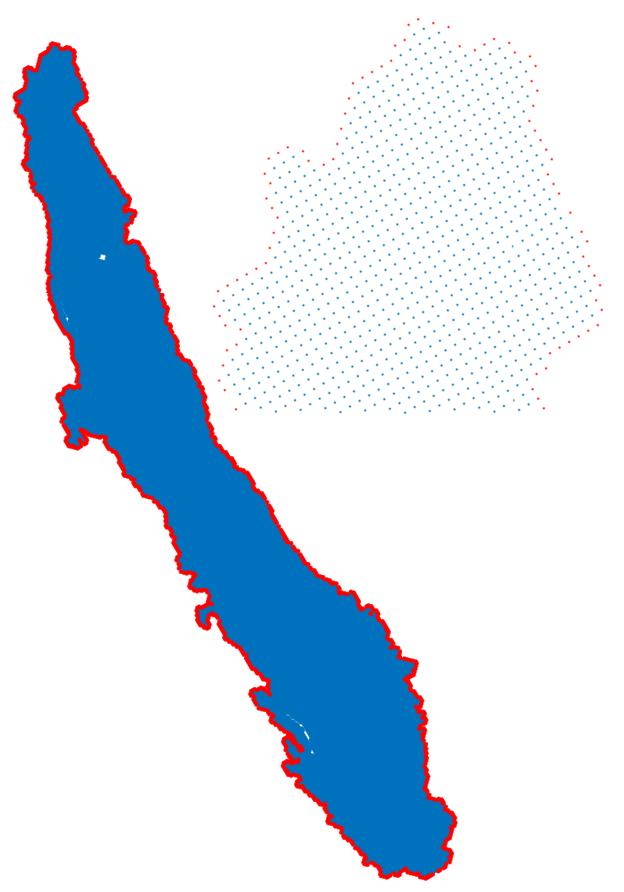

# CVHM_NPSAT

In this project I will prepare the data of Central Valley Aquifer based on
[CVHM](https://ca.water.usgs.gov/projects/central-valley/central-valley-hydrologic-model.html)
model, for the [NPSAT](https://github.com/giorgk/NPSAT) tool.

The majority of the data are obtained from the 
[CVHM database](https://ca.water.usgs.gov/projects/central-valley/cvhm-database.html)
after they have been processed and resampled down to 1 square mile gird.

In few cases processed data have been obtained by direct communication.

## Required Data

The data that describe aquifer properties and elevations must always
return values. To avoid interpolation errors at runtime due to numerical 
round off we generated a layer of nodes around the domain.

For those extra nodes we always use nearest interpolation to assign 
appropriate values

### Mesh file
The CVHM grid is described in the BAS6 shapefile.
The first section of *PrepareGeometryData.m* descibes the steps to
prepare the mesh input file.

### Elevation data
The second section of the *PrepareGeometryData.m* creates the bottom 
elevation data for each of the 10 layers by reading the ascii files from
the CVHM database, which are also included into this repository. 

However only the bottom of aquifer is needed by NPSAT. The elevation of 
the layers above is needed by the aquifer parameter functions

### Aquifer properties
The hydraulic conductivities exists in the database in the form for use
from the MULT and ZONE file. After communication we obtained the proccessed 
HK and VK. However the values are printed using the simulation model 
grid 441 x 98, while in NPSAT we use the rotated grid. The BAS6 shapefile   
contains the info for the correspondence between the two grids.

### Sources & Sinks

#### Groundwater recharge

#### Stream recharge

#### Pumping from wells
