Well Data Analysis
===============

The following is a statistical analysis on the available Central Valley well data. The data will be analyzed with respect to the parameters that are usefull for the Random well generation algorithm. 

- Well density
- Spatial variability of pumping capacity
- Relation between well depth and pumping
- Relation between well screen length depth and pumping

#### Overview of data

The total number of well records in Central Valley that are characterized as public or agricultural is **50,627**. 
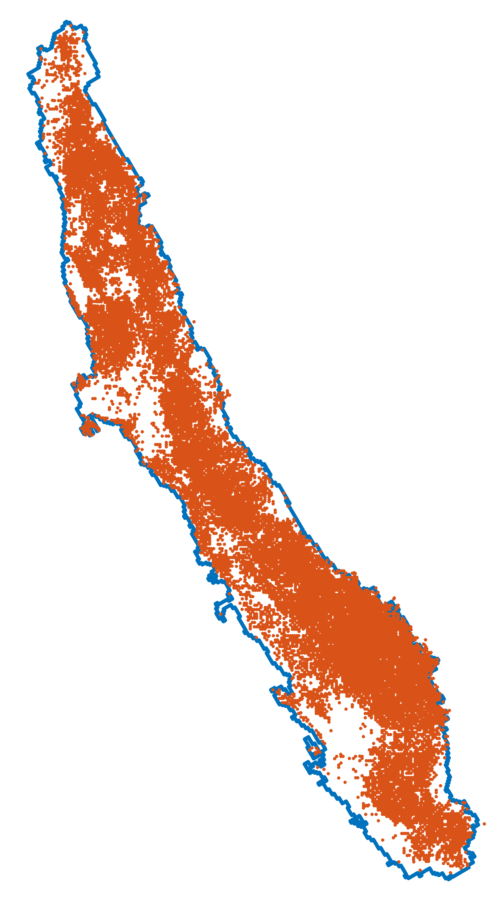

From these records **9,704** have also well yield. 
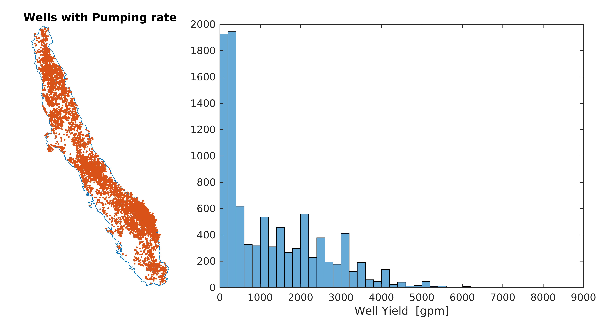

In the well generation algorithm we are interested in developing a relation between Depth and Pumping rate. Out of the 9,704 records **9,348** have both pumping rates and depth. The plots below show the spatial distribution (left), the historgam of depth across Central Valley (right top) and the relation between pumping rate and depth. The red solid line corresponds to a fitted linear model, while the dashed lines corresponds to 95 prediction intervals.
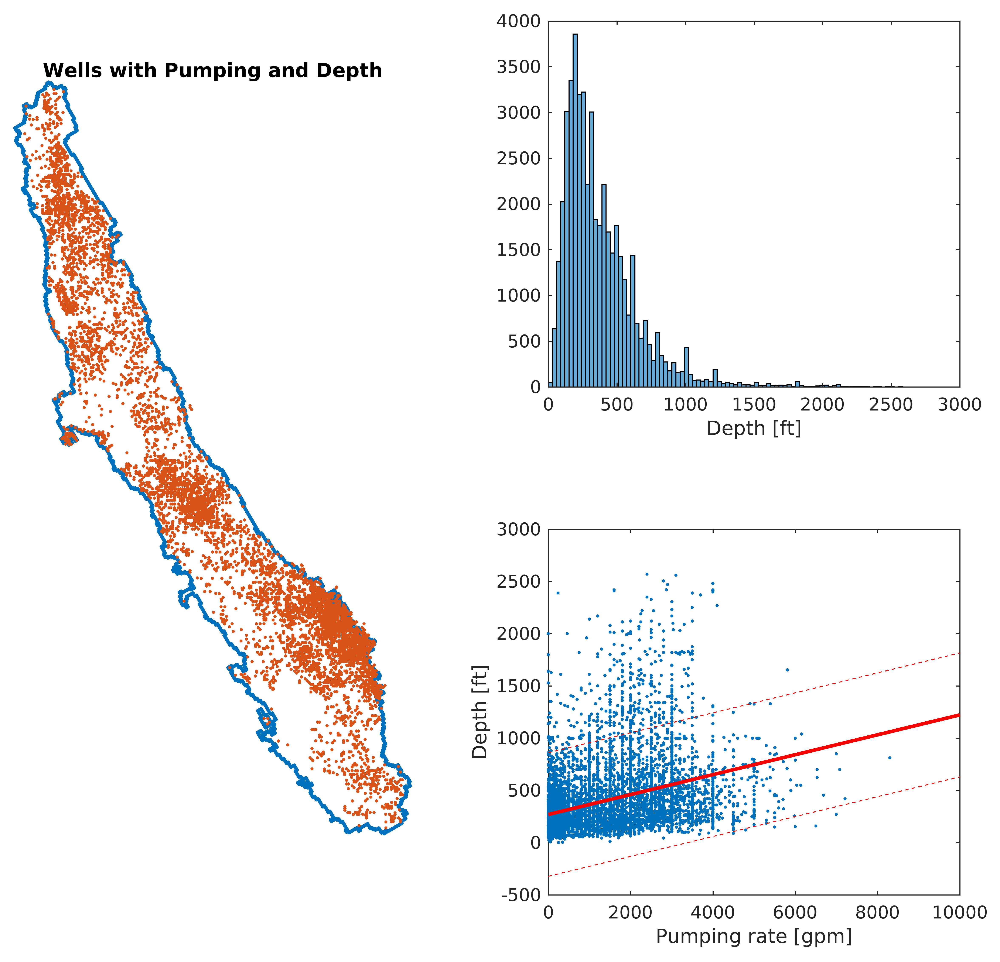

Last for the well generation we need a relation between pumping, depth and screen length. In total there are **6,676** records that have all the information available. 
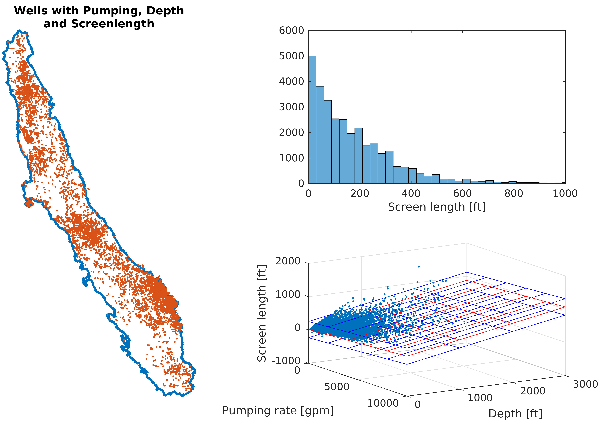

#### Well density
To compute the density map for Central Valley we used a Kernel smooth function. For the density map we used all available data of the initial set i.e. 50,627 wells, and set a gaussian kernel function of 3 km bandwith. The bandwidth was found empirically by trial & error. The figure below shows the computed density map. The left is what the kernel density estimation computes and the right shows the well density assuming that the original data were logged transformed. 
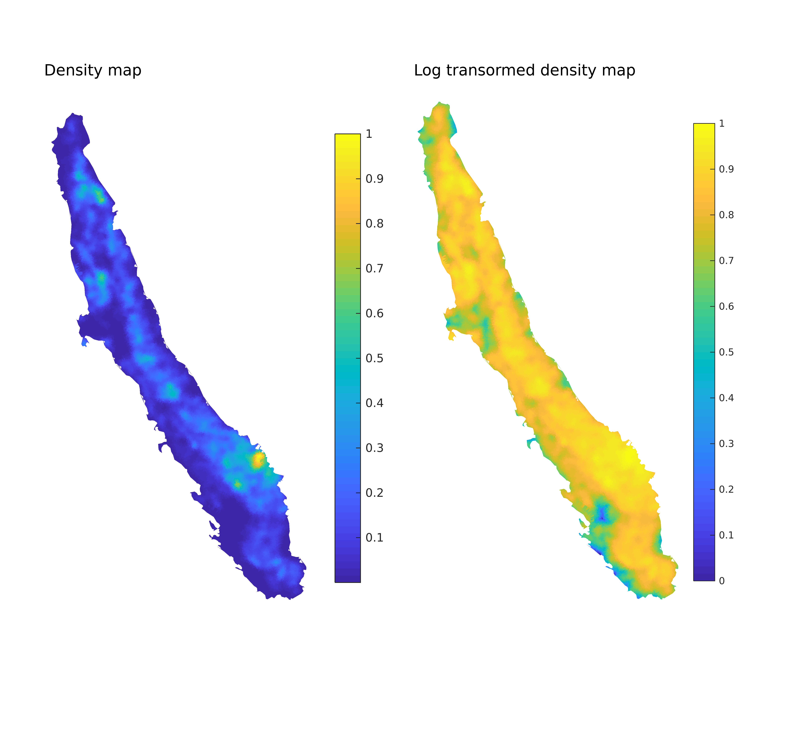

#### Spatial variability of pumping capacity
For the pumping rates we used radial basis function interpolation. First we created a dense grid of points where the pumping rate will be interpolated. For the interpolation we used a weighted average of all wells that have pumping rate. The weight was defined by a radial basis function with 5km radious. In practice wells with distance higher than 5km have 0 weight, while the closer the wells are in the interpolation point the higher the weight. In a similar manner we computed a weighted standard deviation for each interpolation point. Based on the histogram of pumping rates the data are lognormaly distributed, therefore prior to any calculations the data were logged transformed.
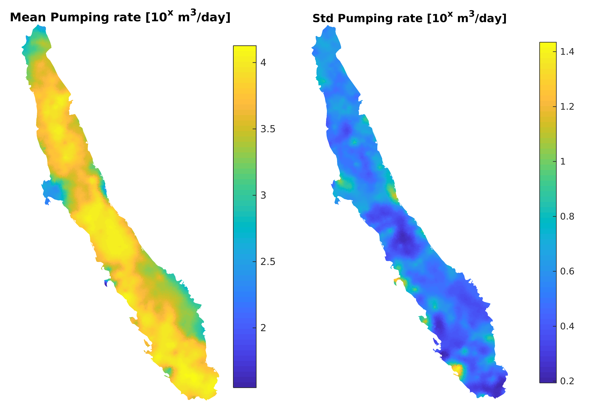

#### Relation between well depth and pumping
Depth is directly related to pumping. Typicaly wells with high pumping rates are deeper. In our analysis we used a simple linear regression model of the form
 
**D = a*Q+b**

However, there is spatial variability accross Central Valley so that not a single formula can be used. Here for the same grid of points that were used for pumping we used weighted linear regression to calculate spatialy variable **a(x,y)** and **b(x,y)** slope and interecept. The weights were computed using radial basis functions with 10km and 5 km radius. Yet, in some cases the data were limited and we increased the radius.
Since both *Q* and *D* are lognormally distributed, the data were first logged transformed. The following maps shows the slope and intecept for 
**Log(D) = a*Log(Q) + b** .
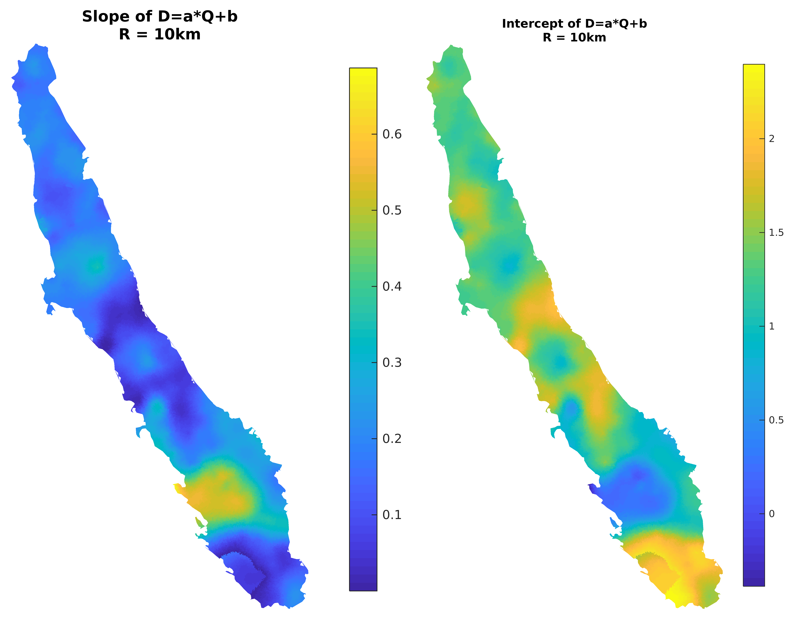
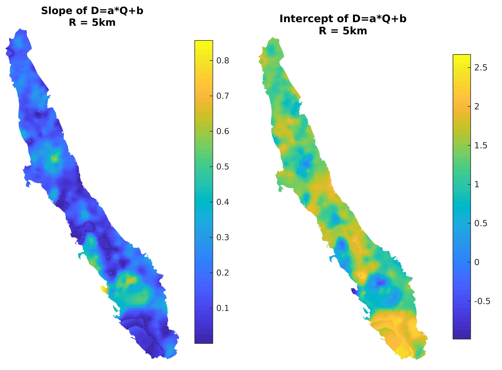
Besides slope and intercept we calculated the slode and intercept that correspond to 95 confidence interval prediction.

#### Relation between well Screen length depth and pumping
In a similar fashion as above we defined a function between well screen, depth and pumping. In particular we used a linear regression model of the form:
**Log(SL) = cx * Log(Q) + cy * Log(D) + c0**
For a grid of points we computed the coefficient of this formula as function of **x** and **y**.
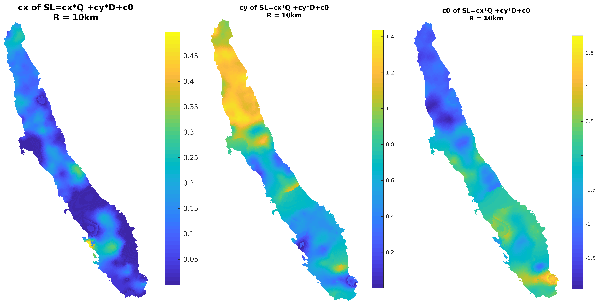
For each of the coefficients we calculated also those that correspond to 95% confidence interval

## Well generation algorithm

Based on the statistical analysis the Well generation algorithm is as follows:

1. Generate a valid *x* and *y* coordinates. Valid coordinates is any point inside the aquifer and some distance (eg 400 m) from the aquifer boundary. A valid point should be some distance away from the rivers (~400m). Last it shoudn't be too close to any existing well.
2. The valid well location is accepted based on the probability of the density map. 
3. Assign Pumping rate **Qw**. Calculate the mean and standard deviation of pumping. Generate a normaly distributed random pumping using the calculated mean and standard deviation. The log Q is back transformed to real units.
4. Assign Depth **Dw**. For the mean and 95 confidence interval interpolate  the slope and the intercept. Calculate mean and standard deviation depth for the x and y coordinates. Next generate a random normaly distributed depth using the mean depth and standard deviation that was derived from th 95 CI.
5. Assign Screen length **SLw**. For the mean and 95 confidence interval interpolate  the coefficients of the formula **Log(SL) = cx * Log(Q) + cy * Log(D) + c0**. Using the formula calculate a mean and 95CI SL based on Qw and Dw. Similarly generate a normaly distributed random screen length using the mean and standard deviation.
6. Make sure that the combination of Depth and Screen length fits inside the aquifer. Compare the Top and bottom of the well screen against the bottom of the aquifer and the initial estimation of the water table.
7. Additionally make sure that for every 100 gpm there is 10 ft of screen length with conductivity > 20 ft/day.
8. Repeat until the wells sum up to the desired total pumping. For the current simulation this is 28,988,263.07 m^3/day

## Simulated Well analysis
#### RUN 1
Results of the first run without tweakings

###### Density
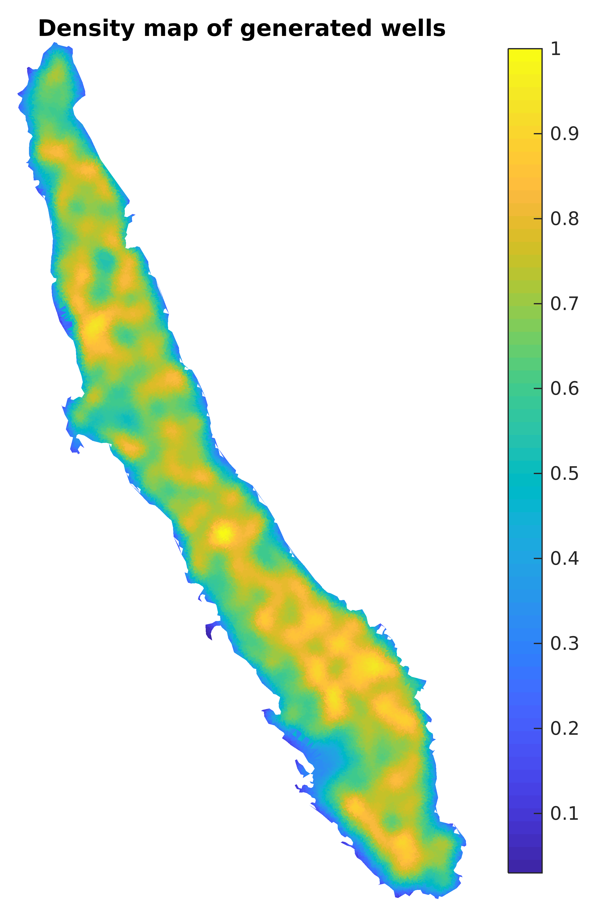 

###### Pumping rates
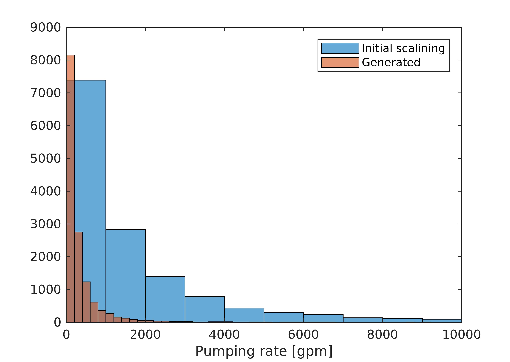 

###### Screen length
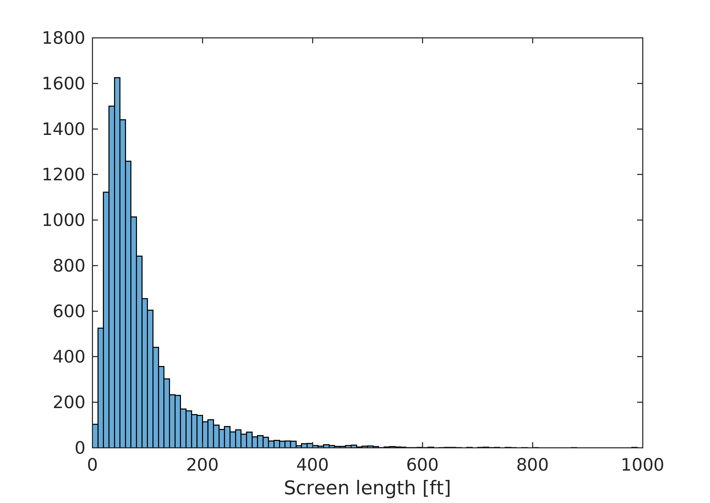 
 
