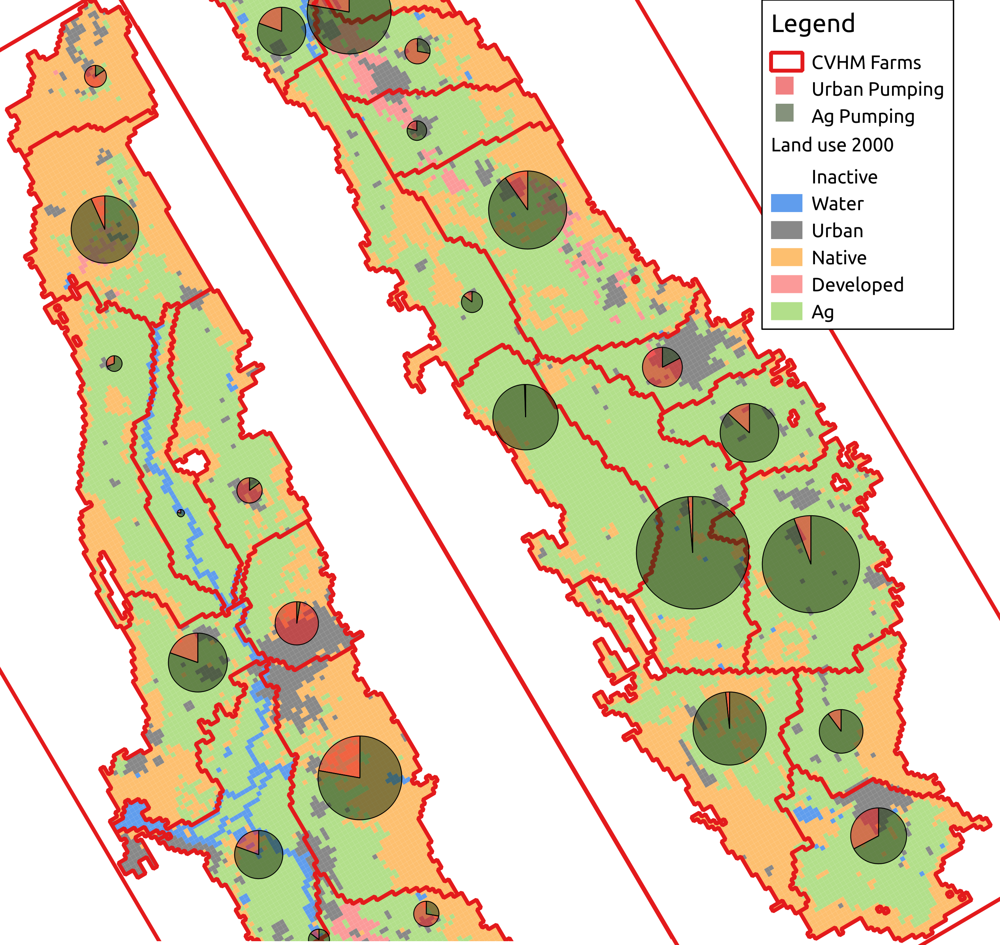
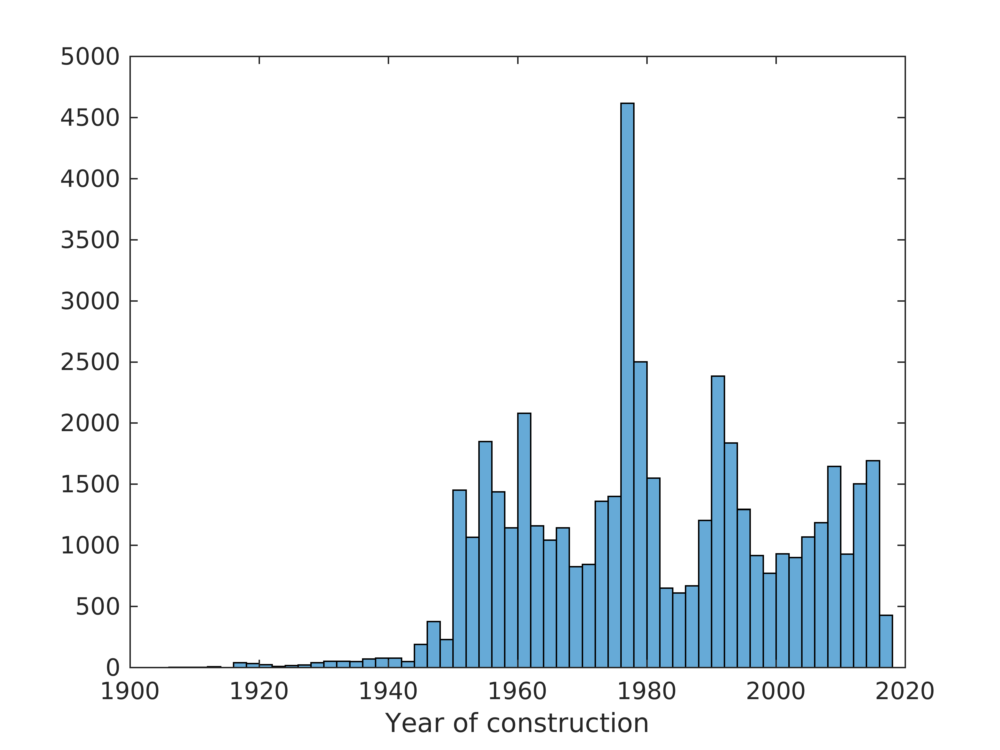
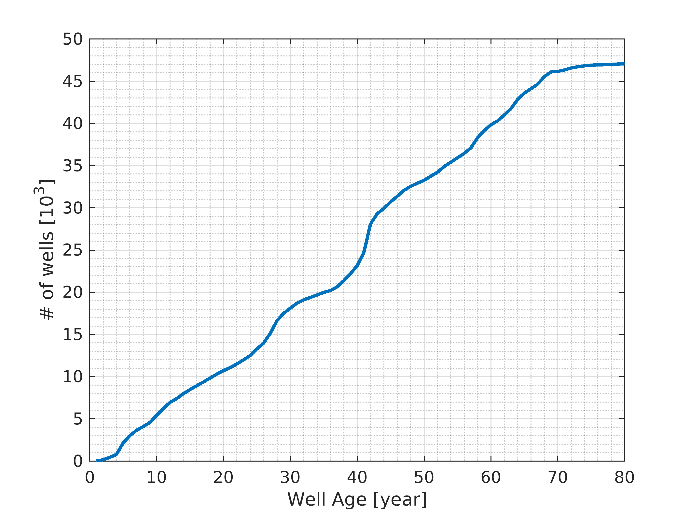
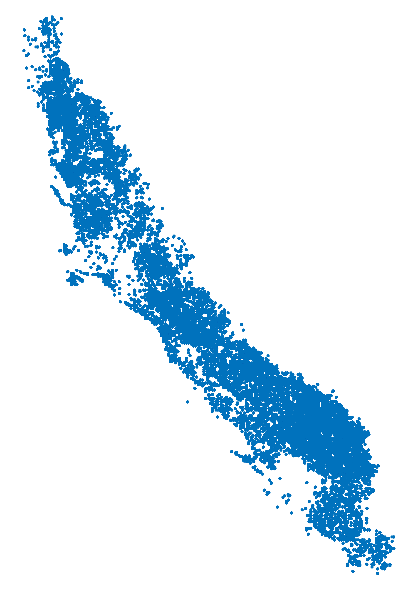
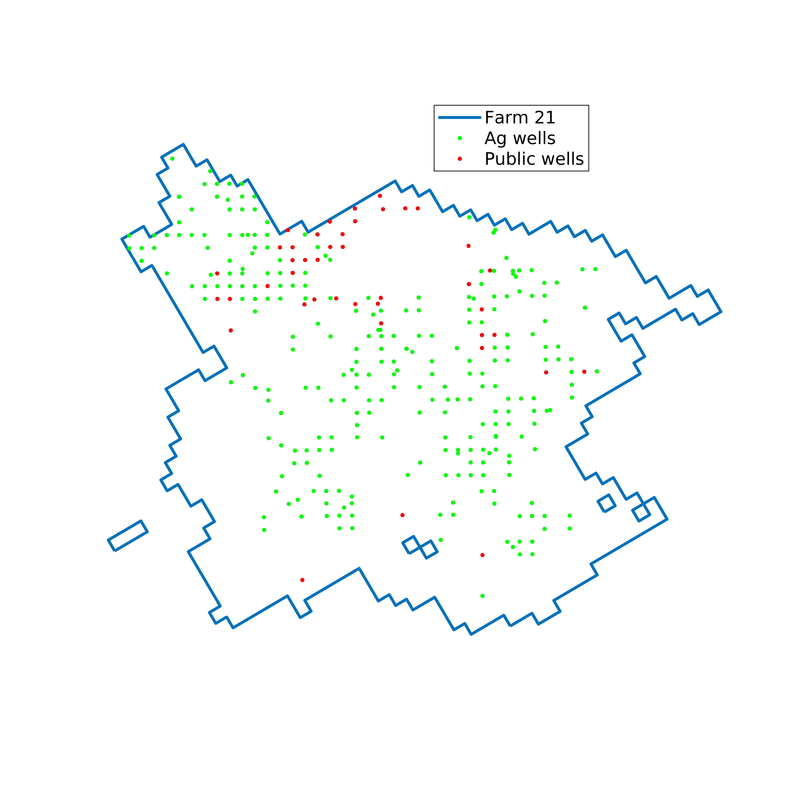
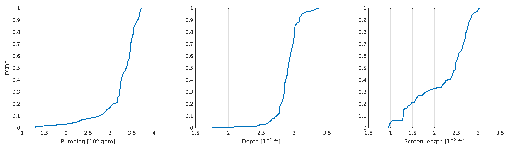
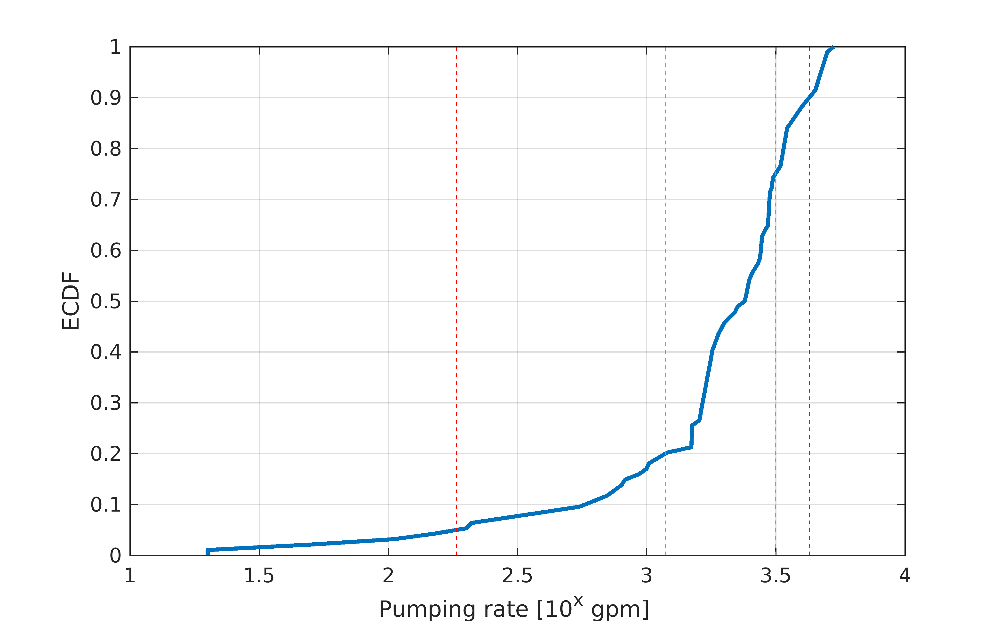
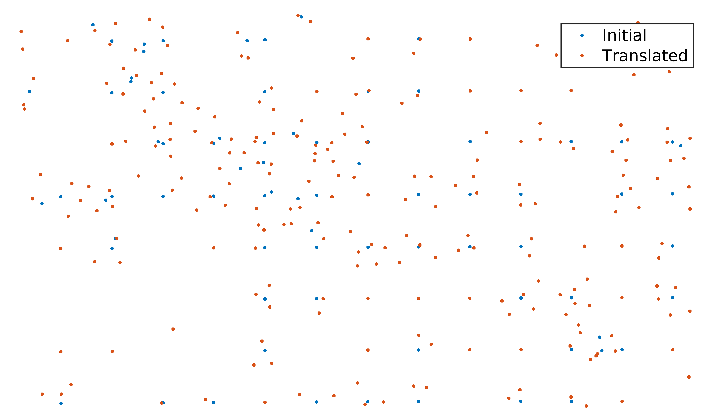

## Well Generation Algorithm V2
#### Data description
In this version the pumping will be distributed according to the CVHM pumping that is showing in the figure. In CVHM there are two types of wells. Multi node and farm wells. The amount of water pumped from each cell at every stress is written in the cell by cell flow output file. In our analysis we averaged the pumping for the period between October 1977 and February 2003. To make a distinction between pumped water used for urban ang agriculture we overlaid the pumping distribution map to the 2000 land use map. 84% of the pumped water was estimated that is used for agricultural  and 16% for urban uses. The ratio between Ag and urban water use is shown for each farm as piechart below.

The well data base contains **50,627** records. When we exclude the wells with unknown or erroneous (190, 2028 etc) construction year the number of wells is **47,510**. The majority of the wells have been constructed after 1950. However in the algorithm we use only the relatively new wells (e.g less than 20-30 years old). The second plot shows the number of wells with respect to the well age. For example we see that there are approximately 5,000 wells that are 10 years old. Here we set the age threshold for public and agricultural wells equal to 30 years. We can see that there are about 18,000 wells that are maximum 30 years old. In addition the spatial distribution of the 18,000 wells covers the entire Central Valley.

#### Well generation algorithm

The algorithm loops through the 21 CVHM Farms.
For each farm:
1. Find the wells that correspond to the farm.
2. Identify which wells are characterized as public and agricultural. For example for farm 21 there are 466 wells with 413 aggricultiral and 53 public.

3. For each of the two sets of agricultural and public wells populate the missing records. The following  is executed once for agricultural and once for public wells.

- Compute the Empirical Cumulative Distribution Function of Pumping, Depth, and Snreen length using the valid records from each set. For example valid are numeric values that make sence (Positive depth and Screen length, nonzero pumping etc)

 - Next loop through the well records and populate the missing values with the help of the ECDFs. 
 For example if all *Q*, *D* and *SL* are missing, assign a random *Q* by picking a uniformly distributed random number *rQ* within [0,1] and interpolate the *Q* that corresponds to that random value.
 For the Depth pick another random number around *rQ* and assign a *D* value. 
 FInally for the Screen length, pick a rndom number around (*rQ* + *rD*)/2 and assign the corresponding Screen length. 
 If there are known values we interpolate their cumulative probability and use that to generate the missing values.
 
 For the Pumping rate to avoid very large and more importantly very small pumping rates the random values are generated within a smaller space [a b] (e.g.( [0.05, 0.9]) space of the ECDF. For the existing pumping rates that lay beyond this space the rates are resampled based on the spaces between the green abd red lines.
 

 
 **Check that again:**
 The above algorithm populates the missing records using independent statistics for each farm and each set of public and agricultural wells.
 However there are some cases were that was not possible. For the public wells, for example, there were farms with very few records that was not possible to compute the required statistics. In those cases we expanded the data set and use the all subbasins records (e.g. Sacramento Valley, San Joaquin Valley Tularey lake basin). In addition, for farm 19 there are not available records with all three of the well properties available and we included for the statistic calclulation the farms 20 and 21. 

#### Correct Pumping
The above algorithm populated all the needed missing records. However the total amount of pumping does not match the amount of pumping that was estimated from the CVHM model. To correct the pumping we scaled the pumping rates for each farm and each ag or public well set to match the total pumping per farm.

#### Correct location
The well sets contains six methods of coordinate determination. For two of them we use the provided coordinates, while for the remaining the coordinates were translated up to 800 m on each direction:

| Method of determination | In Algorithm |
| -----------------------------     | ---------------- |
| Derived from Address      | Use 
| Derived from TRS       	   | Translate
| GPS				   | USE
| NA					   | Translate
| Other				| Translate
|Unknown			| Translate

**Clarify what the other methods mean**

  